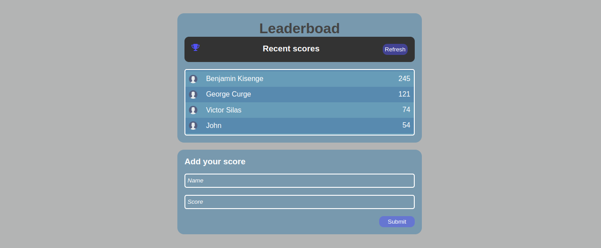

# Leaderboard

> A leaderboard showing the names and current scores of the leading competitors.The project is set up as a javaScript project using webpack and ES6 features.



## Built With

- Html
- Csss
- Js
- Technologies used: webpack, Git, Github
- REST Api

## Live Demo (if available)

[Live Demo](https://iambenkis.github.io/Leaderboard/dist/)

## Getting Started

To get the project locally , run
```bash
git clone https://github.com/iambenkis/Leaderboard.git
```

### Prerequisites

- node
- npm

### Install

Install webpack with npm :

```bash
npm install --save-dev webpack
```

### Usage

- To get the configuration of the app: Run
```bash
npm install
```

- API consuming
```bash
  const getScore = async () => {
  const response = await
  fetch('https://us-central1-js-capstone-backend.cloudfunctions.net/api/games/Jimsa5KtKCwfICVDsBiC/scores/');
  let scores = [];
  scores = await response.json();
  return scores.result;
};
```

### Run tests

- To update changes : Run
```bash
npm run build
```
- To launch the app locally: Run
```bash
    npm start
```

## Authors

👤  **Benjamin Kisenge**

* GitHub: [@benjamin kisenge](https://github.com/iambenkis)
* Twitter: [@benjamin kisenge](https://twitter.com/iambenkis)
* LinkedIn: [benjamin kisenge](https://www.linkedin.com/in/ben-kisenge/)

## 🤝 Contributing

Contributions, issues, and feature requests are welcome!

Feel free to check the [issues page](../../issues/).

## Show your support

Give a ⭐️ if you like this project!

## Acknowledgments

- Hat tip to anyone whose code was used
- Inspiration
- etc

## 📝 License

This project is [MIT](./LICENSE) licensed.

_NOTE: we recommend using the [MIT license](https://choosealicense.com/licenses/mit/) - you can set it up quickly by [using templates available on GitHub](https://docs.github.com/en/communities/setting-up-your-project-for-healthy-contributions/adding-a-license-to-a-repository). You can also use [any other license](https://choosealicense.com/licenses/) if you wish._
